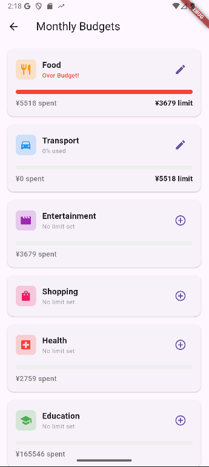
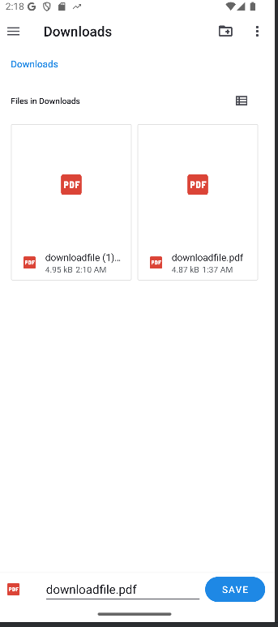
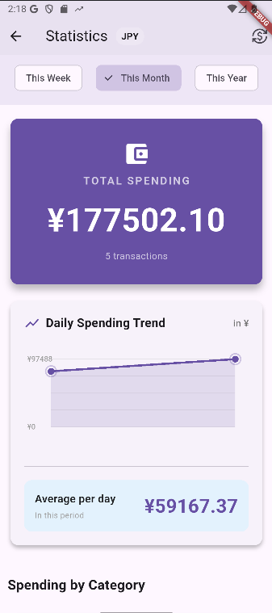
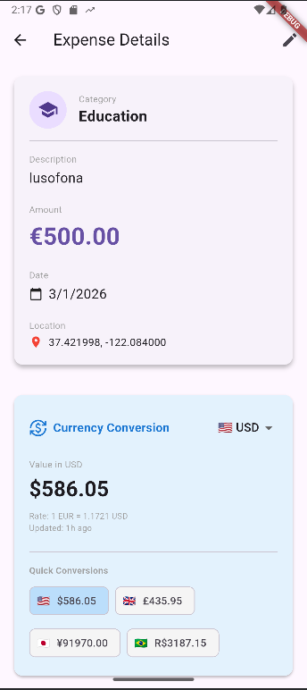
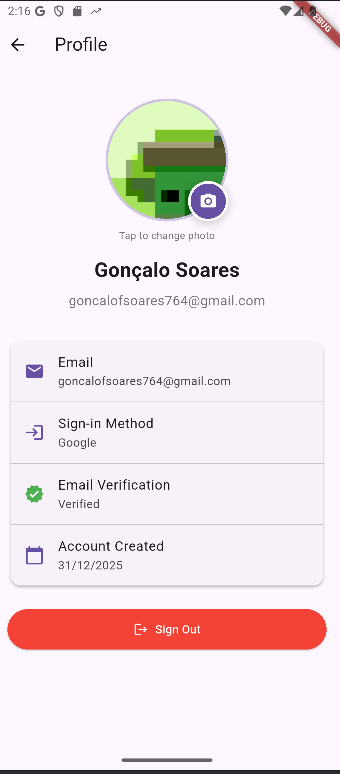
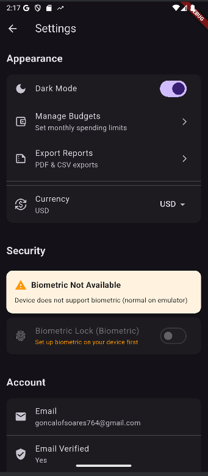

# Expense Tracker App 

**A Smart Financial Companion for Personal Expense Management.**

This Flutter application helps users track their daily expenses, manage budgets, and analyze spending habits with intuitive charts and reports. Built with a focus on privacy and usability, it features multi-currency support, dark mode, and offline-capable data management.

### Demo Video 🎥
[](https://youtu.be/wXR3c0AHRn4)

### Screenshots 📱
| | | |
|:---:|:---:|:---:|
|  |  |  |
|  |  |  |
|  |  | |

## Features List 

### Core Features
- **Expense Tracking**: Add, edit, and delete expenses with categories, descriptions, and amounts.
- **Smart Filtering**: Filter expenses by date range, category, or search by keywords.
- **Visual Analytics**: Interactive charts showing spending trends (Daily Average, Category Distribution).
- **Multi-Currency Support**: Real-time currency conversion (EUR, USD, GBP, JPY, etc.) using live exchange rates.
- **Budget Management**: Set monthly limits per category and track progress.
- **Recurring Expenses**: Automatically generate recurring bills (Daily, Weekly, Monthly, Yearly).
- **Receipt Attachments**: Attach photos to expenses (stored locally).
- **Reports**: Export detailed expense reports to PDF and CSV.

### Native & Advanced Features
- **Dark Mode**: Fully adaptive UI for light and dark themes.
- **Location Tagging**: Automatically saves GPS location for expenses (viewable in details).
- **Biometric Authentication**: Secure login using Fingerprint/Face ID (Device dependent).
- **Local Storage**: Images are compressed and stored locally on the device to ensure privacy and avoid cloud costs.

## Architecture 

### Folder Structure
```
lib/
├── models/         # Data classes (Expense, Budget, UserProfile)
├── providers/      # State Management (AuthProvider, ExpenseProvider, SettingsProvider, BudgetProvider)
├── screens/        # UI Screens (Home, Login, Settings, Statistics)
├── services/       # External Integrations (Firestore, Currency, Storage, Reports)
├── widgets/        # Reusable UI Components
└── main.dart       # Entry point & App Config
```

### State Management
The app uses the **Provider** pattern for state management:
- **AuthProvider**: Manages Firebase Authentication state and user profile.
- **ExpenseProvider**: Handles CRUD operations for expenses, syncing with Firestore, and managing Recurring logic.
- **BudgetProvider**: Manages budget limits and tracks spending against them.
- **SettingsProvider**: Controls global app settings like Theme and Currency.

### Design Patterns
- **Repository/Service Pattern**: Logic for data fetching (Firestore, APIs) is isolated in Services, keeping UI clean.
- **Observer Pattern**: Providers notify listeners (UI) of state changes.

## Setup Instructions 

### Prerequisites
- Flutter SDK (>=3.0.0)
- Firebase Account
- Android Studio / VS Code

### Installation
1.  **Clone the repository**:
    ```bash
    git clone https://github.com/goncSoares/project2-expense-tracker.git
    cd project2-expense-tracker
    ```
2.  **Install dependencies**:
    ```bash
    flutter pub get
    ```
3.  **Firebase Setup**:
    - Project is configured for Firebase. Ensure `google-services.json` is present in `android/app`.
    - Enable **Authentication** (Email/Password, Google).
    - Enable **Firestore Database**.
4.  **Run the App**:
    ```bash
    flutter run
    ```

> **Note**: Biometric Authentication requires a real device or a generic emulator image with security configured. It may not work on all emulator instances.

## Firebase Configuration 

### Firestore Collections
- **`users/{userId}/profile`**: User profile data (displayName, email).
- **`users/{userId}/settings`**: User preferences (currency, theme).
- **`users/{userId}/expenses`**: Collection of Expense documents.
- **`users/{userId}/budgets`**: Collection of Budget documents.

### Storage
- **Local Storage**: Unlike typical apps using Firebase Storage, this app purposely uses **Local Device Storage** (`path_provider`) for saving receipt images and profile pictures. This decision was made to avoid Firebase Storage costs (Credit Card requirement) and enhance user privacy. Backups are not synced to the cloud.

### Security Rules
Standard Firestore rules should be applied to allow users to access only their own data:
```javascript
match /users/{userId}/{document=**} {
  allow read, write: if request.auth != null && request.auth.uid == userId;
}
```

## API Documentation 

### Currency Conversion
- **Provider**: [Frankfurter API](https://www.frankfurter.app/)
- **Endpoint**: `https://api.frankfurter.app/latest?from={from}&to={to}`
- **Usage**: Converts expense amounts to the user's preferred display currency in real-time.
- **Caching**: Rates are cached daily to minimize network requests.

## Technologies Used 🛠️

- **Flutter**: 3.x (Dart 3.x)
- **Firebase**: Auth, Firestore
- **Provider**: State Management
- **HTTP**: API requests
- **Geolocator**: GPS services
- **Local Auth**: Biometrics
- **Printing/PDF**: Report generation
- **CSV**: Data export

## Challenges & Solutions 

### 1. Cloud Storage Restrictions
**Challenge**: Firebase Storage requires a billing account (Credit Card), which was not available.
**Solution**: Implemented a custom `StorageService` that saves images to the device's local file system. This required handling file permissions and path management manually but resulted in a cost-free solution.

### 2. Complex State Dependencies
**Challenge**: `ExpenseProvider` needed User ID from `AuthProvider`, and `BudgetProvider` needed data from `ExpenseProvider`.
**Solution**: Used `ChangeNotifierProxyProvider` to inject dependencies dynamically, ensuring that Providers update correctly when Authentication state changes.

### 3. Emulator Limitations
**Challenge**: Biometric features are hard to test on standard emulators.
**Solution**: Implemented graceful degradation. The app checks hardware availability (`canCheckBiometrics`) and hides the option if unsupported.


## Credits 

- **Currency API**: [Frankfurter](https://www.frankfurter.app/)
- **Icons**: Material Design Icons
- **Tutorials**: Flutter Documentation, Firebase Codelabs.
